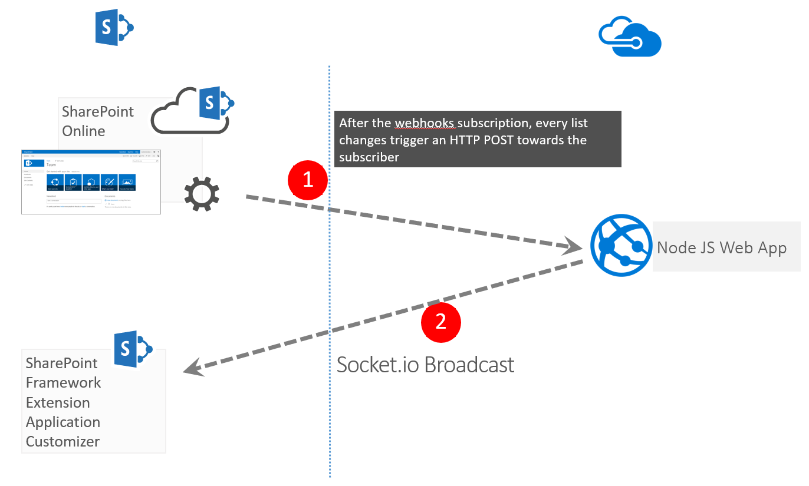

# Webhooks Notification Application Customizer

## Summary

Sample SharePoint Framework application customizer showing how to leverage the SharePoint webhooks capabilities, in order to show toast notifications.
The libraries used by this solution are Socket.io, sp pnp js, moment.


## Solution Architecture



## Used SharePoint Framework Version


## Applies to

* [SharePoint Framework Extensions Developer](https://dev.office.com/sharepoint/docs/spfx/extensions/overview-extensions)
* [Office 365 developer tenant](http://dev.office.com/sharepoint/docs/spfx/set-up-your-developer-tenant)

## Solution

Solution|Author(s)
--------|---------
react-application-webhooks-notification|Giuliano De Luca ([www.delucagiuliano.com](http://www.delucagiuliano.com), [@giuleon](https://twitter.com/giuleon))

## Version history

Version|Date|Comments
-------|----|--------
1.0.0|November 05, 2017|Initial release

## Disclaimer

**THIS CODE IS PROVIDED *AS IS* WITHOUT WARRANTY OF ANY KIND, EITHER EXPRESS OR IMPLIED, INCLUDING ANY IMPLIED WARRANTIES OF FITNESS FOR A PARTICULAR PURPOSE, MERCHANTABILITY, OR NON-INFRINGEMENT.**

---

## Prerequisites

> In order to use properly this solution is necessary follow these steps:
> * Istall a webserver that will receive the webhooks, for this PoC I created a NodeJs Application hosted on Azure take a look on my solution [https://github.com/giuleon/SharePoint-Webhooks-Broadcaster](https://github.com/giuleon/SharePoint-Webhooks-Broadcaster)
> * run the Powershell script **ProvisionList.ps1** in order to provision the list Events which is required for this SPFx extension
> * Create a new webhooks subscription for the SharePoint List **Events** (that will be installed by running the script **ProvisionList.ps1**), as you prefer, across your solution or Postman, please read the following guideline to achieve this goal [https://docs.microsoft.com/en-us/sharepoint/dev/apis/webhooks/overview-sharepoint-webhooks](https://docs.microsoft.com/en-us/sharepoint/dev/apis/webhooks/overview-sharepoint-webhooks)
> * The SPFx extension has been developed (GetChanges API) to notify new items added in the **Events** list

## Minimal Path to Awesome

* clone this repo
* in the command line run
  * `npm i`
  * `gulp serve --nobrowser`
* If you want to debug the solution append the following query string parameters to a moder page URL
  * Insert your Node JS app URL for the property **WebhooksSocketServer**
```text
?loadSPFX=true&debugManifestsFile=https://localhost:4321/temp/manifests.js&customActions={"c0c009bd-5299-4c13-9826-9068022ce804":{"location":"ClientSideExtension.ApplicationCustomizer","properties":{"WebhooksSocketServer":"https://webhooksbroadcaster.azurewebsites.net"}}}
```
* create a new item into the list **Events** if you have another modern page opened, you will see the toast notification (This obviously will happen for all client/employees with a modern page opened)


## Deployment

In order to deploy the sample solution in a real environment, or at least in order to skip using the debug mode, you need to execute the following steps:
* Insert the **cdnBasePath** value in the **writemanifests.json**
* bundle and package the solution by executing the following commands in the command line:
  * `gulp bundle --ship`
  * `gulp package-solution --ship`
* deploy the bundle and the package manually or by launching the following script, read my blog posts to go deepen and eventually configuring also the continuous integration and deployment
  > [http://www.delucagiuliano.com/automated-deployment-of-your-sharepoint-framework-solution-to-office-365-cdn](http://www.delucagiuliano.com/automated-deployment-of-your-sharepoint-framework-solution-to-office-365-cdn)

  > [http://www.delucagiuliano.com/continuous-integration-and-deployment-for-your-sharepoint-framework-solutions](http://www.delucagiuliano.com/continuous-integration-and-deployment-for-your-sharepoint-framework-solutions):
  * **DeploySPFxToO365CDN.ps1** (Adding the bundle to Office 365 CDN)
  * **DeploySPFxToAppCatalog.ps1** (Upload and deploy of the sppkg into the App Catalog)
* the sample is tenant-wide available, so you don't need to install it to every single target site, you simply need to bind the application customizer to the target site. In order to do that, you can use the PowerShell script [ProvisionCustomizer.ps1](./ProvisionCustomizer.ps1)
* be sure that the list Events exists in your target site

## Features

The solution illustrates how to display toast notifications by receiving a webhook, every time that a new item is added to the list **Events**.
Every user connected to the target site (Modern view) will be able to display a notification (Title and link) for ten seconds.

This sample illustrates the following concepts on top of the SharePoint Framework:

* how to leverage the webhooks capabilities in order to display toast notifications
* using React to build SharePoint Framework application customizers


